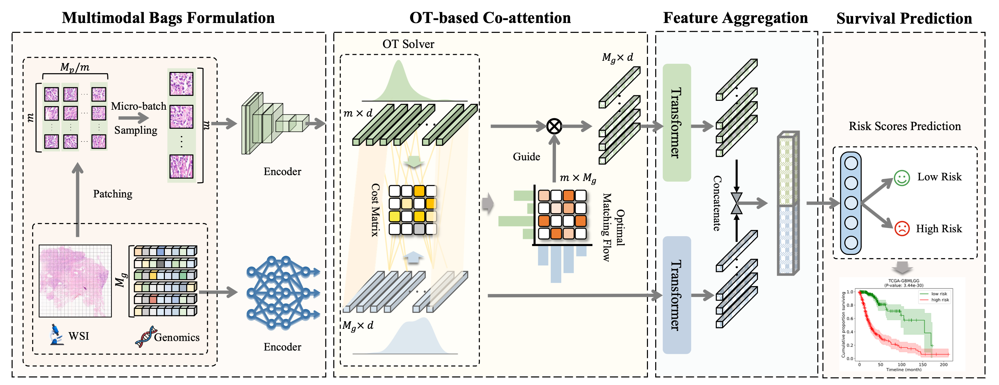

# MOTCat
<details>
<summary>
  <b>Multimodal Optimal Transport-based Co-Attention Transformer with Global Structure Consistency for Survival Prediction</b>, ICCV 2023.
  <a href="https://arxiv.org/abs/2306.08330" target="blank">[arxiv]</a>
  <a href="https://openaccess.thecvf.com/content/ICCV2023/papers/Xu_Multimodal_Optimal_Transport-based_Co-Attention_Transformer_with_Global_Structure_Consistency_for_ICCV_2023_paper.pdf" target="blank">[paper]</a>
  <br><em>Yingxue Xu, Hao Chen</em></br>
</summary>

```bash
@InProceedings{Xu_2023_ICCV,
    author    = {Xu, Yingxue and Chen, Hao},
    title     = {Multimodal Optimal Transport-based Co-Attention Transformer with Global Structure Consistency for Survival Prediction},
    booktitle = {Proceedings of the IEEE/CVF International Conference on Computer Vision (ICCV)},
    month     = {October},
    year      = {2023},
    pages     = {21241-21251}
}
```
</details>

**Summary:** Here is the official implementation of the paper "Multimodal Optimal Transport-based Co-Attention Transformer with Global Structure Consistency for Survival Prediction".



### News
<ul>
<li> [01/04/2024] Upgraded OT module to its <font color="red"> GPU version </font>, which allows larger Micro-Batch or the removal of Micro-Batch setting. The <font color="red"> Pre-requisites </font> have been updated accordingly. In this case, we have set it to <font color="red">16384</font>, resulting in  <font color="red">notably accelerated</font> training speed. Based on the preliminary validation, the performance is consistent with the previous version. We will report the updated results soon. </li>
</ul>

### Pre-requisites (<font color="red">new!!</font>):
```bash
python==3.9.19
pot==0.9.3
torch==2.2.1
torchvision==0.17.1
scikit-survival==0.22.2
```
### Prepare your data
#### WSIs
1. Download diagnostic WSIs from [TCGA](https://portal.gdc.cancer.gov/)
2. Use the WSI processing tool provided by [CLAM](https://github.com/mahmoodlab/CLAM) to extract resnet-50 pretrained 1024-dim feature for each 256 $\times$ 256 patch (20x), which we then save as `.pt` files for each WSI. So, we get one `pt_files` folder storing `.pt` files for all WSIs of one study.

The final structure of datasets should be as following:
```bash
DATA_ROOT_DIR/
    └──pt_files/
        ├── slide_1.pt
        ├── slide_2.pt
        └── ...
```

DATA_ROOT_DIR is the base directory of cancer type (e.g. the directory to TCGA_BLCA), which should be passed to the model with the argument `--data_root_dir` as shown in [command.md](./scripts/command.md).

#### Genomics
In this work, we directly use the preprocessed genomic data provided by [MCAT](https://github.com/mahmoodlab/MCAT), stored in folder [dataset_csv](./dataset_csv).

## Training-Validation Splits
Splits for each cancer type are found in the `splits/5foldcv ` folder, which are randomly partitioned each dataset using 5-fold cross-validation. Each one contains splits_{k}.csv for k = 1 to 5. To compare with MCAT, we follow the same splits as that of MCAT.

## Running Experiments
To train MOTCat, you can specify the argument in the bash `train_motcat.sh` stored in [scripts](./scripts/) and run the command:
```bash
sh scripts/train_motcat.sh
```
or use the following generic command-line and specify the arguments:
```bash
CUDA_VISIBLE_DEVICES=<DEVICE_ID> python main.py \
--data_root_dir <DATA_ROOT_DIR> \
--split_dir <SPLITS_FOR_CANCER_TYPE> \
--model_type motcat \
--bs_micro 256 \
--ot_impl pot-uot-l2 \
--ot_reg <OT_ENTROPIC_REGULARIZATION> --ot_tau 0.5 \
--which_splits 5foldcv \
--apply_sig
```
Commands for all experiments of MOTCat can be found in the [command.md](./scripts/command.md) file.

## Acknowledgements
Huge thanks to the authors of following open-source projects:
- [MCAT](https://github.com/mahmoodlab/MCAT)
- [CLAM](https://github.com/mahmoodlab/CLAM)
- [POT](https://github.com/PythonOT/POT)

## License & Citation 
If you find our work useful in your research, please consider citing our paper at:
```bash
@InProceedings{Xu_2023_ICCV,
    author    = {Xu, Yingxue and Chen, Hao},
    title     = {Multimodal Optimal Transport-based Co-Attention Transformer with Global Structure Consistency for Survival Prediction},
    booktitle = {Proceedings of the IEEE/CVF International Conference on Computer Vision (ICCV)},
    month     = {October},
    year      = {2023},
    pages     = {21241-21251}
}
```
This code is available for non-commercial academic purposes. If you have any question, feel free to email [Yingxue XU](https://innse.github.io/).
